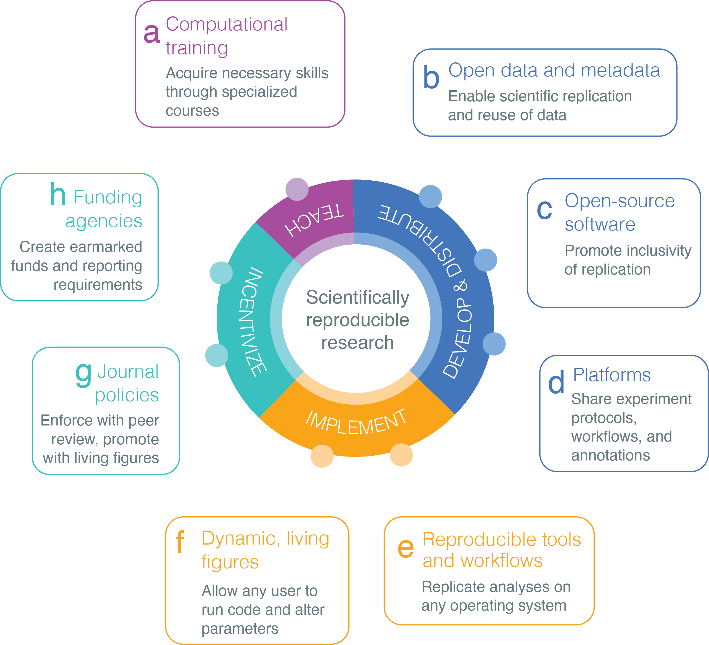

## Introduction

Biomedical informatics has the opportunity to be at the forefront of the
biomedical community in practices around open data, open software, and
reproducible research. The computational reproduction of previously
published results is enabled by publicly releasing all research
resources, from raw data to installable packages and source code, in a
discoverable and archivally stable manner. However, a lack of strict
implementation or enforcement of journal, academic institutions and
funder policies for resource sharing has resulted in the loss of crucial
research objects for many published studies. Publications lacking data
or source code undermine scientific rigor, transparency, and
reproducibility @doi:10.1073/pnas.1708290115.

An astonishing number of bioinformatics software tools are designed each
year to accommodate increasingly bigger, more complex, and more
specialized biomedical
datasets @pmid:27153671. Many of
those software tools have limited installability and are hosted on
Uniform Resource Locators (URLs) with undetermined archiving
practices @doi:10.1186/s13059-019-1649-8.
Closed-source software is another issue as researchers may not have
access to the source code, which harms the transparency of research by
avoiding others to audit methods and results. Here we discuss the
pressing need for scientists to improve software availability,
usability, and archival stability in computational biology. By following
a set of best
practices @doi:10.1186/s13742-016-0135-4, scientists
can promote rigor and reproducibility, ultimately cultivating a
sustainable, thriving research community.

## 1. Increase computational training opportunities targeted at reproducibility

Biomedical researchers who use computational tools
must acquire specific computational skills in order to successfully
apply the techniques to a large amount of data. Undergraduate students
who lack formal computational training can be taught the skills required
to promote reproducibility on specialized
courses @doi:10.1128/mSystems.00297-19. In addition
to rigorous class training, advanced undergraduate and graduate students
may benefit from short-term intensive workshops aimed at postdoctoral
scholars, clinical fellows, and
faculty @doi:10.1128/mSystems.00467-19. Several
institutions, including the University of California at Los Angeles,
have successfully hosted workshop-based programs for over five years and
serve as valuable resources for pedagogy and
curricula @pmid:28720283,@url:https://github.com/greenelab/GCB535.
Workshops for training researchers to use computational tools usually
include hands-on training for implementing analysis tools, such as
computational notebook technologies. Since 1998, Software Carpentry
([https://software-carpentry.org/](https://software-carpentry.org/)**)**
has been holding volunteer-based training courses for researchers with
the computational skills required to keep up with the demands of data-
and computational-intensive research. In summary, comprehensive
computational training programs are the way to prime future
computational biologists towards reproducibility work in the data-driven
fields of life science and biomedical research (**Figure 1a**).

##  2. Make all data and metadata open and discoverable
Open source code depends on open and shareable data. Access to the data used to
produce important research results is key for auditing the rigor of
published studies. Open access to datasets is imperative to build a
thriving and sustainable scientific community where all researchers can
access and analyze existing data. However in practice, omics data of
patients often can not be shared publicly due to patient privacy and/or
user agreement
standards @url:https://www.nature.com/collections/diadgjciaj,
@doi:10.1038/s41467-018-05227-z,
@doi:10.1038/ng.3351,
@doi:10.1038/ng.3968,
@doi:10.1038/ng.3499,
@doi:10.1038/s41588-017-0021-8,
@pmid:30510254,
@doi:10.1038/s41581-019-0166-z.
While not all data are freely publicly available, many studies provide
controlled access, where researchers can access the raw data if they are
approved after providing the reason to and signing user agreements.
Also, in many cases where raw data are not accessible by the public use,
summary data are available. The global data sharing climate in general
has shifted towards a positive direction.

In general, the data should also be discoverable via centralized
repositories like SRA and GEO and annotated with descriptive metadata to
enhance data reuse (**Figure 1b**). When data is shared on centralized
repositories in interoperable formats, other researchers can examine and
re-analyze the data, challenge existing interpretations, and test new
theories. In general, data sharing corresponds to a true spirit of
science where each new discovery is built upon previous work - allowing
us to “stand on the shoulders of giants”. Discoveries in multiple fields
were solely based on shared data (e.g., economics, meteorology, and
physics). Sharing data can enable the reproducibility and robustness of
science because of the ability to utilize data generated from individual
studies to a larger scale. Additionally, secondary analysis is
economically sustainable and can be used in countries with limited
resources @doi:10.7287/peerj.preprints.27415v1, @doi:10.1038/s41587-019-0053-y.
In general, reusing the data speaks about the quality and importance of
generated data and contributed to the impact of the original work.

##  3. Build and use open-source software
 The software provides a
foundation for the reproducibility of published biomedical research,
defined as the ability to replicate published findings by running the
same computational tool on data generated by the study @doi:10.1186/s13742-016-0135-4;@doi:10.1128/mSystems.00297-19.
For this reason, closed-source and proprietary software restricts the
reproducibility of biomedical research. First, researchers may not have
access to the source code, which limits their ability to audit the
results and reviewers are unable to test the reproducibility prior to
being published . Second, license restrictions may prohibit the creation
of new functionalities that would be released on modified versions of
existing tools. For proprietary software, generally, there is also the
cost of acquisition and maintenance of licenses, which is not affordable
for every laboratory. Reviewers may also not have access to proprietary
software, and are thus, unable to fully test reproducibility of results.
Therefore, the adoption of standard open source licenses for data and
software tools can enhance the rigor and impact of research by allowing
others to reproduce published studies.

However, only publicly releasing the code does not guarantee the
computational reproducibility of biomedical research. The open code must
be well documented with user manuals, and installable in a user-friendly
manner. The code used in a published analysis should be hosted on an
archivally stable platform such as GitHub (**Figure 1c**). Currently,
over a quarter of computational software resources cannot be accessed
through the URLs provided in the original publication, suggesting that
the repositories are poorly
maintained @doi:10.1186/s13059-019-1649-8.
Additionally, many bioinformatics tools are too difficult, and some
impossible, for a new user to
install @doi:10.1186/s13059-019-1649-8. Use of Open
Source Initiative license models
([https://opensource.org/licenses](https://opensource.org/licenses))
allows users to easily use and adapt tools, increasing the
sustainability of the biomedical research community. New platforms are
also being proposed, such as CODE CHECK
([https://sje30.github.io/codecheck/](https://sje30.github.io/codecheck/)),
where researchers can, input their code and data, and check that their
analysis is reproducible. For verified analyses, CODE CHECK issues a
time-stamped “*certificate of reproducible computation*” which can
inform the peer reviewer of a paper.

## 4. Use platforms that enhance reproducibility
In addition to software and datasets, computational biology researchers commonly
produce resources such as experiment protocols, workflows, and
annotations. Storing and sharing these resources allows other
researchers to cite them within a publication, which would increase the
reproducibility of a paper and increase the visibility of previously
developed methods. The inclusion of citable digital object identifiers
(DOIs) also facilitates the discovery of reusable resources as they
provide long-term access to published resources. Several innovative
platforms designed to promote reproducibility have recently emerged
(**Figure 1d**).

## 5. Make tools and workflows reproducible
To facilitate the reproducibility of tools it is good practice to utilize virtual machines
(VMs) and containers. VMs are software pieces that are capable of
encapsulating entire operating systems, libraries, codes, and data. For
workflows, it is good practice to utilize workflow-specific platforms to
enhance
reproducibility @doi:10.1016/j.cels.2018.03.014,
such as Galaxy, Bioconda and workflow standards, such as CWL (Common
Workflow Language) **(Table 1**). There are now a myriad of platforms
and tools available that make research reproducible - **Table 1** below
is a summary of some commonly used. Given the many different tools and
platforms available that can promote reproducibility, a research lab
should define their own standards on a suite of tools and platforms that
support their research practices (**Figure 1e**).

**Table 1:**

<table>
<thead>
<tr class="header">
<th width="30%"><strong>Platform &amp; Type</strong></th>
<th><strong>Use</strong></th>
</tr>
</thead>
<tbody>
<tr class="odd">
<td><strong>Reproducible and open methods</strong></td>
<td><strong>Protocols.io</strong> An open-source protocol repository, where researchers can manage, share, tweak, optimize and adopt existing methods even after a scientist has left a lab.</td>
</tr>
<tr class="even">
<td><strong>RRIDs</strong></td>
<td><strong>Scicrunch.org</strong> A platform for curating research resources that enables the user to discover, access, view, and use research objects. Users can register any research object, such as tools, antibodies, animal models etc In turn,. these get issued a RRID (Research Resource ID) which should be cited in the manuscript. The RRID allows other users to easily locate and access the resources.</td>
</tr>
<tr class="odd">
<td><strong>Annotations</strong></td>
<td><strong>Hypothes.is</strong> Is an open-source annotation tool that allows any researcher to annotate any resource on the web, including to create annotations for personal use or as part of conversations with private groups or the general public.</td>
</tr>
<tr class="even">
<td><strong>Virtual Machines &amp; Containers</strong></td>
<td>Containers such as <strong>Docker</strong>(www.docker.com), and <strong>Singularity</strong> (singularity.lbl.gov) are lightweight solutions compared to VMs as they do not encapsulate the operating system; rather, they rely on the host kernel to run required functions. Both VMs and containers are shared via image files and can be included as supplementary material at certain journals or stored in Zenodo (https://zenodo.org/), Figshare (https://figshare.com/), or other general-purpose archival repositories.</td>
</tr>
<tr class="odd">
<td><strong>Reproducible workflows</strong></td>
<td>
<strong>Galaxy</strong> (<a href="https://galaxyproject.org/">https://galaxyproject.org/</a>) - a computational platform which allows users to share workflows, histories and wrapped tools in an easy-to-use and open source interface that even people without coding experience can use.,

<strong>Conda</strong> (<a href="https://conda.io/">https://conda.io/</a>) is a powerful open source package and management system that can quickly install, run and update packages and their dependencies.

<strong>Bioconda</strong> (<a href="https://bioconda.github.io/">https://bioconda.github.io/</a>) - leveraging Conda, it is a community project and package manager dedicated to the life sciences and biomedical tools.

<strong>Common workflow language (CWL)</strong>, <a href="https://www.commonwl.org/">https://www.commonwl.org</a> )- is an open standard used to describe workflows and tools to make them portable and interoperable across different environments e.g. cloud, cluster or high performance computing.
</td>
</tr>
<tr class="even">
<td><strong>Reproducible documents &amp; Figures</strong></td>
<td>
<strong>Stencila</strong> (<a href="https://stenci.la/">https://stenci.la/</a>) is an open source framework for executable documents and living figures (using R scripts). It supports commonly used environments and tools, such as Juptyer notebook, RMarkdown, Python and SQL.

<strong>Jupyter Notebook</strong> (<a href="https://jupyter.org/">https://jupyter.org/</a>) - allows for the creation of sharing of live code, equations, visualizations and narrative text. The application supports over 40 different programming languages and can be used to leverage big data.

<strong>MyBinder</strong> (<a href="https://mybinder.org/">https://mybinder.org/</a>) - is an application that collects and ‘binds’ interactive jupyter notebooks into a Binder repository and can also create a Docker image of that.
</td>
</tr>
</tbody>
</table>

## 6. Make living and reproducible figures and papers
Open data and code is one thing; however over the last 5 years it has been possible to
break away from the static presentation of results and produce dynamic/
living figures (**Figure 1f**) - where a reader and alter the parameters
and code is actively
running @doi:10.5256/f1000research.4564.r5630. In
principle, the things associated with such figures, include the raw
data, and R code to evaluate the data, as well as the functionality of
the paper to call the data using software to compute an evaluation. Once
such example is Stenci.la - a platform for executable documents and
living figures and Jupyter Notebook (**Table 1**).

## 7. Publish with journals that promote reproducibility
Journals have various publishing standards. Researchers may elect to publish in
journals that encourage best practices (e.g., adopting the FAIR
principles @doi:10.1038/sdata.2016.18) that
aim to increase the impact of their work (**Figure 1g**). A group of
stakeholders from academia and industry defined a set of principles
stating that research data should be Findable, Accessible,
Interoperable, and Reusable
(FAIR) @doi:10.1038/sdata.2016.18. To ensure
reproducibility, many journals now require that biomedical data
generated by a published study be shared when the paper is released. For
instance, *GigaScience* (gigasciencejournal.com) has been promoting
reproducibility of analyses since 2012 by mandating open data that
follow the FAIR principles and mandates source source code with an OSI
approved license. During peer review, *GigaScience* also makes all
supporting data and code available for Reviewers - asking them to test
for reproducibility; and papers presenting VMs, containers, Jupyter
notebooks or packaged workflows makes this task easier. Other journals,
such as *Biostatistics*, have implemented badges for articles with data
and code
sharing @doi:10.12688/f1000research.13477.2)**.**
*eLife* published their first example of a dynamic and computationally
reproducible article - which enables data and analysis to be fully
reproducible by the
reader @doi:10.7554/eLife.30274. It is a
code-based publication (using the Stencila platform, **Table 1**),
challenging the traditional static representation of results using PDF
or HTML formats.

## 8. Support reusable resources
Successfully implementing and widely distributing software tools developed in academia involves unique
challenges when compared to the industry. In academia, software tools
are developed by small groups comprised of graduate or postdoctoral
scholars, who have fairly fast turn-over rates of 2-5
years @doi:10.1038/nbt.2721. These groups
are less professionally trained when compared to software development
groups in the industry, where holistic teams of specialists support the
long-term maintenance of projects. In order to enhance the quality and
reuse of open software, professionally trained software engineers should
be hired to partner with the students and postdocs. To make this happen,
funding agencies need better mechanisms of acknowledging and
incentivizing funding earmarked for critical bioinformatics
infrastructure (**Figure 1h**). In addition, funders should recognize
the rigor of software development, rather than just considering
'novelty'-based conventional criteria of research. The availability of
well-resourced grant mechanisms to convert minimum viable products
produced by trainees into reliable software could enhance the impact of
research-grade software on the community @doi:10.1038/s41467-018-05227-z. With the growing
number of biomedical datasets open for reuse in the public domain, It is
inspiring to see the encouragement and acknowledgement of data reuse and
secondary analysis with the research Parasite
Awards @pmid:28358134. The
annual Parasite Awards recognizes the exceptional contributions for
rigorous secondary analysis of data with two award tracks - Junior
parasite and continued research parasitism. More incentives, such as
this, are required for software reuse.

**Figure 1.** Recommendations to improve reproducibility and rigor of
research.

## Conclusions

We outlined key recommendations to improve the rigor of biomedical
studies and foster reproducibility in computational biology. The
infrastructure required to systematically adopt best practices for
reproducibility of biomedical research is largely in place. The
remaining challenge to the systemic promotion of reproducibility is that
incentives are not currently aligned to support good practices. Instead,
current efforts rely on individual researchers electing to follow best
practices, often at their own time and expense. We believe it is time
for a fundamental cultural shift in the scientific community: rigor and
reproducibility should become primary concerns in the criteria and
decision-making process of designing studies, funding research, and
writing and publishing results. Successful systematic adoption of best
practices will require the buy-in of multiple stakeholders in the
scientific communities, from publishers, academic institutions, funding
agencies, and stakeholders. This increases the lifetime and value of
published research as resources naturally become reusable, testable, and
discoverable. Community-wide adoption of best practices for
reproducibility is critical to realizing the full potential of
fast-paced, collaborative analyses of large datasets in the biomedical
and life sciences.

##  Abbreviations

CWL, Common Workflow Language; DOI, Digital Object identifier; FAIR,
Findable, Accessible, Interoperable, and Reusable; OSI, Open Source
Initiative; VM, Virtual Machine.

## Competing interests

The authors declare that they have no competing interests.

## Funding

CSG was supported by grants from the NIH (R01HG010067 and R01CA237170),
the Gordon and Betty Moore Foundation (GBMF4552), the Chan Zuckerberg
Initiative Donor Advised Fund of the Silicon Valley Community Foundation
(2018-182718), and Alex’s Lemonade Stand Foundation (CCDL). LXG is
supported by grants K01ES025434 awarded by NIEHS through funds provided
by the trans-NIH Big Data to Knowledge (BD2K) initiative
(http://datascience.nih.gov/bd2k), R01 LM012373 and R01 LM012907 awarded
by NLM, and R01 HD084633 awarded by NICHD. The funding bodies had no
role in the design of the study and collection, analysis, and
interpretation of data and in writing the manuscript.

## Authors' contributions

| **Author** | **Contribution**                                                                                                                |
| ---------- | ------------------------------------------------------------------------------------------------------------------------------- |
| JJB        | Writing - Original Draft Preparation, review and editing.                                                                       |
| JL         | Writing - review and editing.                                                                                                   |
| CSG        | Writing - review and editing.                                                                                                   |
| JM         | Writing - review and editing.                                                                                                   |
| NN         | Conceptualization and structure of the manuscript; Writing - review and editing; Visualization - creation of Figures and Table. |
| LG         | Conceptualizing the project; Writing - review and editing.                                                                      |
| SM         | Conceptualization and structure of the manuscript; Writing - review and editing.                                                |

##  Acknowledgments

We thank Dr. Lana Martin for discussions and helpful comments on the
manuscript.

## Authors’ Information

NAN is an Editor at *GigaScience* and is an open science advocate with
over 7 years experience in publishing reproducible research.
